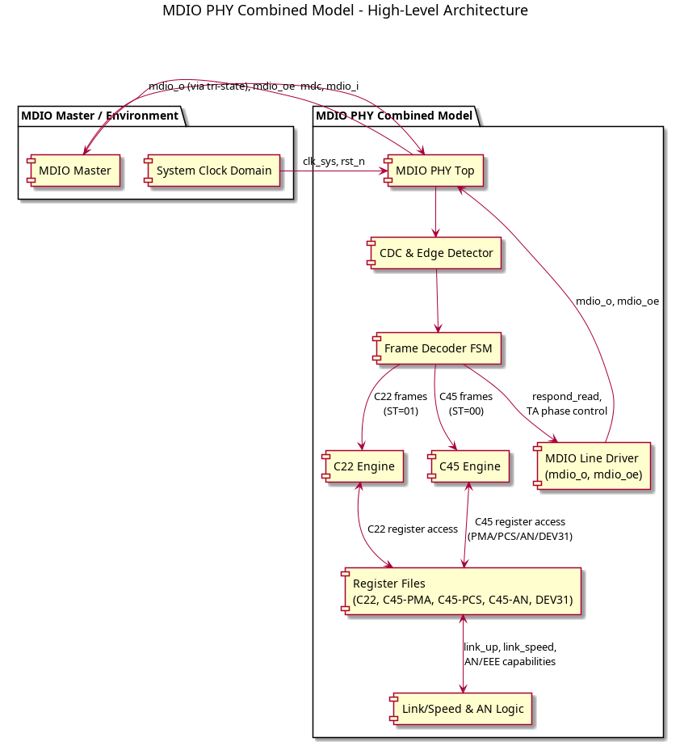
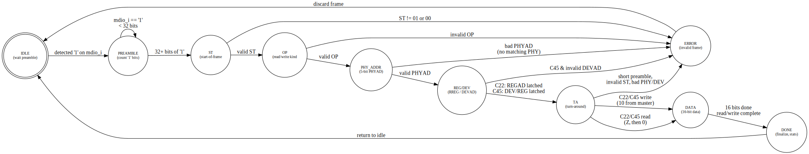
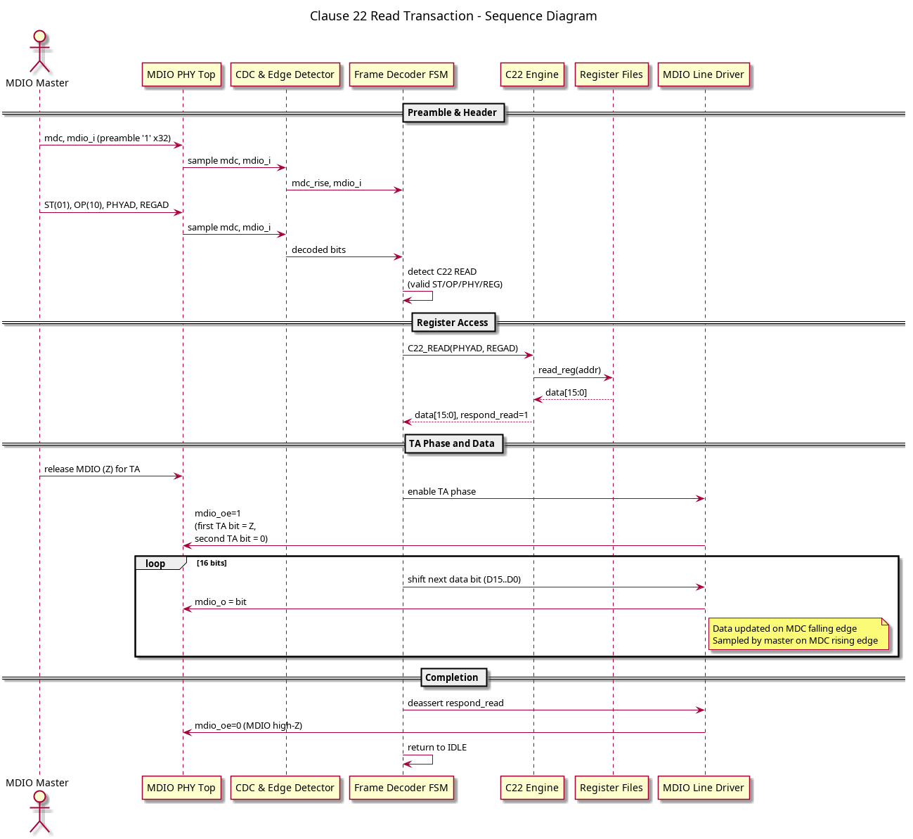
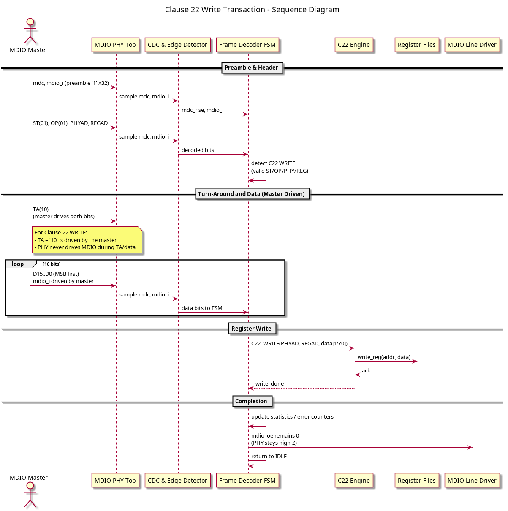
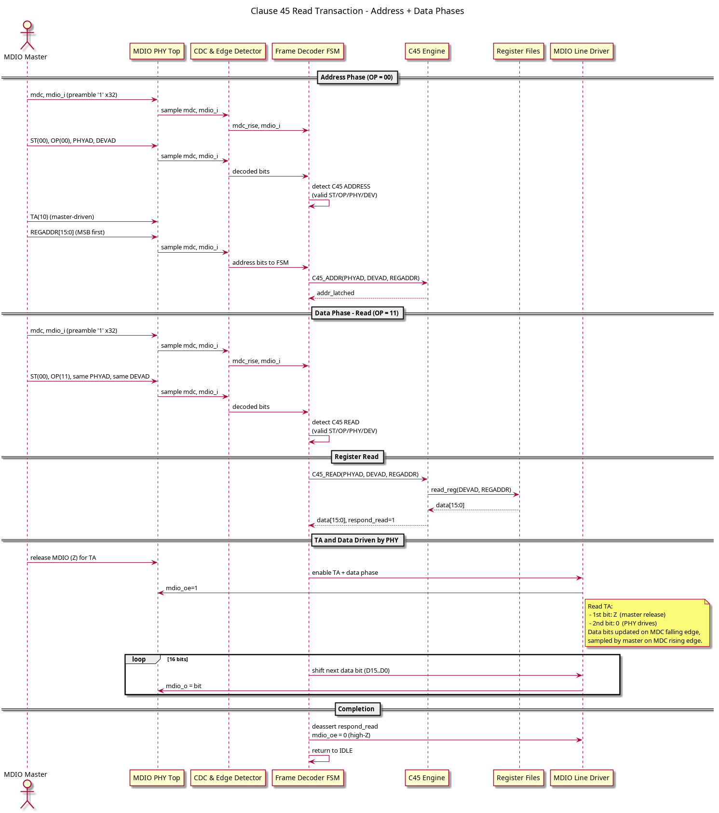
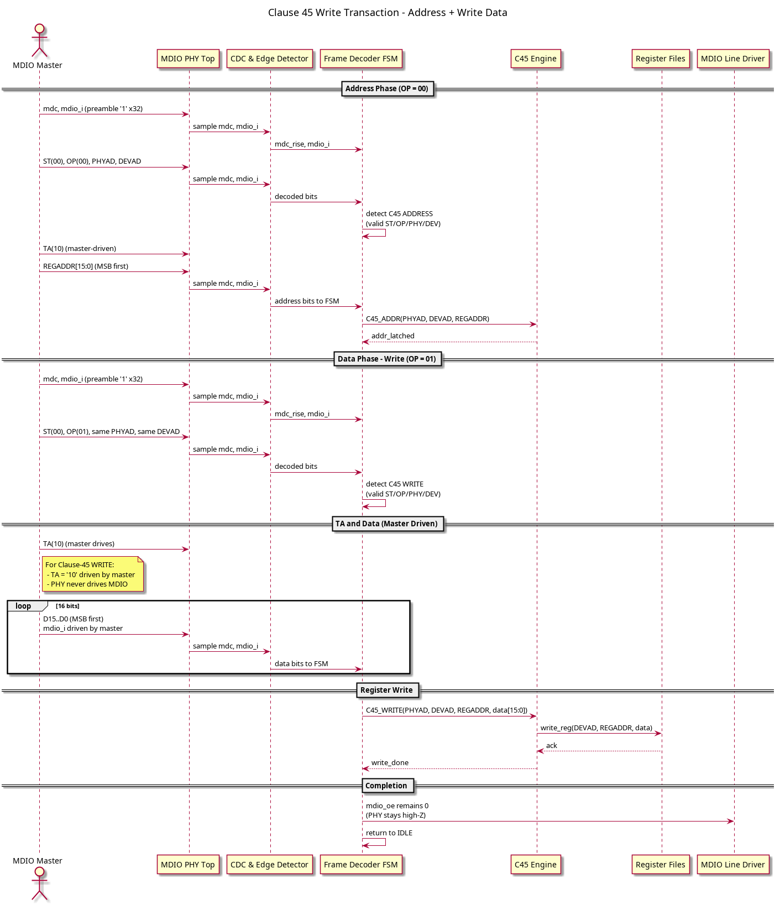

# MDIO PHY Combined Model  
**IEEE 802.3 Clause 22 + Clause 45 Behavioral PHY for FPGA Verification, Firmware Bring-Up, and Driver Development**

[](LICENSE)
[]()
[]()

This repository provides a **synthesizable, timing-accurate MDIO PHY Behavioral Model** implementing both **Clause 22** and **Clause 45** of the IEEE 802.3 standard.  
It is designed for:

- FPGA verification  
- MDIO controller / MAC driver bring-up  
- FTDI MPSSE-based MDIO debugging  
- Automated regression and negative testing  
- Hardware-level protocol analysis

The model has been verified extensively in:

- **Icarus Verilog**  
- **Vivado Simulator**  
- **Real FPGA hardware**  
- **FT2232H MPSSE fast backend (up to 2 MHz MDC)**

---

## Features

### Clause 22 (C22)

- Full register map (BMCR, BMSR, PHYID1/PHYID2, ANAR, ANLPAR, ESR, GBCR, GBSR)
- Z0 TA behavior (IEEE compliant)
- 16-bit read/write, MSB-first
- Short preamble detection
- Invalid ST filtering
- Wrong PHY address rejection

### Clause 45 (C45)

- Complete two-phase protocol (address + data)
- Supported devices:
  - **DEV 1** – PMA/PMD  
  - **DEV 3** – PCS  
  - **DEV 7** – AN  
  - **DEV 31** – Vendor-specific (256×16 registers)
- Validates DEVAD
- C45 read TA = Z0 (IEEE compliant)
- Link, speed, AN, and EEE registers included

### Behavioral Accuracy

- MDC rising/falling edge detection
- MDIO tristate simulation (`mdio_oe`)
- Read data driven on MDC falling edge
- First TA bit is Z, second bit is 0
- Matches oscillograms from real PHYs

### Verification Capabilities

- Sanity tests (C22/C45)
- C22/C45 stress tests (randomized)
- Negative tests:
  - invalid PHY
  - invalid DEVAD
  - invalid ST
  - short preamble
- Link/speed control interactions
- Device 31 custom register verification

---

## Repository Structure

```

.
├── /
│   ├── mdio_phy_combined_model.sv       # Main PHY model
│   └── ... additional modules
├── iverilog/testbench/
│   ├── mdio_phy_combined_model_tb.sv    # Self-checking testbench
│   └── wave.do / waveform configs
├── tools/
│   ├── manual_mdio_fast_c22             # FTDI C22 host utility
│   ├── manual_mdio_fast_c45             # FTDI C45 host utility
│   └── shared MPSSE backend
├── docs/
│   ├── APPNOTE.md                       # Full Application Note
│   └── diagrams/                        # FSM, timing, block diagrams
└── README.md

````

---

## Quick Start

### 1. Simulate using Icarus Verilog

```bash
iverilog -g2012 -o mdio_tb tb/mdio_phy_combined_model_tb.sv src/mdio_phy_combined_model.sv
vvp mdio_tb
````

### 2. Open Waveforms

```bash
gtkwave mdio.vcd
```

### 3. Run C22 host test via FTDI MPSSE

```bash
./manual_mdio_fast_c22 --backend fast --phy 3 --freq 2000000
```

### 4. Run C45 host test

```bash
./manual_mdio_fast_c45 --backend fast --phy 3 --dev 3 --reg 0
```

---


## Diagrams

This project provides full architecture, FSM, and protocol-level sequence diagrams for MDIO Clause-22 and Clause-45 operations.  
All diagrams are generated automatically from PlantUML and Graphviz sources located in `docs/diagrams/`.

---

### MDIO PHY Architecture

<p align="center">
  
</p>

---

### MDIO PHY FSM (Frame Decoder State Machine)

<p align="center">
  
</p>

---

## Clause-22 Protocol Diagrams

### Clause-22 Read Sequence

<p align="center">
  
</p>

### Clause-22 Write Sequence

<p align="center">
  
</p>

---

## Clause-45 Protocol Diagrams

### Clause-45 Read Sequence

<p align="center">
  
</p>

### Clause-45 Write Sequence

<p align="center">
  
</p>


## Timing Diagrams (ASCII)


### Clause 22 Read

```
MDIO master : 1111...1111 01 10 AAAAA RRRRR  Z  Z
MDIO PHY    : -----------------------------  Z  0 D15..D0 ----
```

### Clause 45 Address + Read

```
ADDR PHASE: 1111...1111 00 00 AAAAA DDDDD 10 ADDR[15:0] Z
READ PHASE: 1111...1111 00 11 AAAAA DDDDD  Z  Z
PHY RESP  : -------------------------------- Z  0 D15..D0 ----
```

---

## Integration in FPGA Projects

### 1. Tri-State Wiring Example

```systemverilog
wire mdio;

assign mdio = phy_oe    ? phy_o    :
              mac_oe     ? mac_o    :
              1'bz;

assign phy_i = mdio;
assign mac_i = mdio;
```

### 2. Clocking Requirements

```
clk_sys >= 4 × MDC
```

Validated:

| clk_sys | MDC   |
| ------- | ----- |
| 100 MHz | 2 MHz |
| 50 MHz  | 1 MHz |

---

## Testbench

The provided testbench performs:

* Sanity tests
* C22/C45 R/W tests
* Negative protocol tests
* Link state transition tests
* Stress testing (random op sequences)
* FSM state coverage
* Noise robustness tests

All tests complete with:

```
========== ALL TESTS PASSED ==========
```

---

## Hardware Validation

The PHY model has been tested against real hardware:

* FPGA (Artix-7 / Cyclone V)
* FT2232H-based MPSSE MDIO master
* 1–2 MHz MDC
* Both C22 and C45 verified

Example log:

```
TA0=1, TA1=0
C22 REG3 = 0x5C90
C45 READ DEV3[0x0000] = 0x55AA
```

Matches simulation precisely.

---

## Documentation

Full documentation is available in:

* **docs/APPNOTE.md** – full Application Note
* Block diagrams
* Comprehensive timing diagrams
* MDIO protocol explanation
* C22/C45 register descriptions
* Integration notes

---

## License

This project is licensed under the Apache License, Version 2.0.

You may obtain a copy of the license at:

    http://www.apache.org/licenses/LICENSE-2.0

Unless required by applicable law or agreed to in writing, software
distributed under this project is provided on an "AS IS" BASIS,
WITHOUT WARRANTIES OR CONDITIONS OF ANY KIND, either express or implied.
See the LICENSE file for the specific language governing permissions and
limitations under the License.

See `LICENSE` and `NOTICE` for details.

---

## Contributions

Contributions are welcome:

* Additional Clause-45 devices
* Extended testbenches
* Real PHY register map imports
* Performance improvements
* FPGA example projects

Open an issue or submit a pull request.

---

## Contact

For questions or integration support, open a GitHub Issue.
FPGA/driver development consultancy available upon request.

---

**Enjoy accurate, deterministic MDIO verification.
This model has been tested, battle-proven, and validated on real hardware.**

